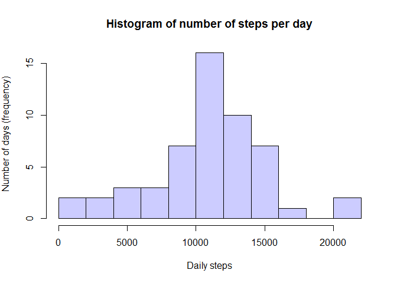
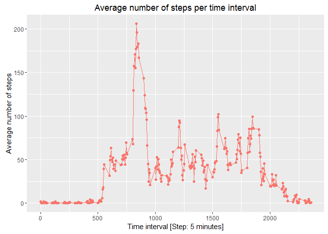
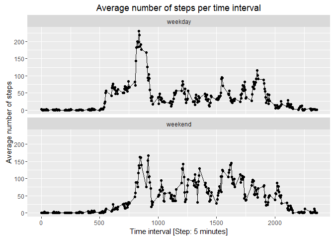

Reproducible Research: Peer Assessment 1
================
Minimalia
April 3, 2016

Introduction
============

It is now possible to collect a large amount of data about personal movement using activity monitoring devices such as a Fitbit, Nike Fuelband, or Jawbone Up. These type of devices are part of the "quantified self" movement - a group of enthusiasts who take measurements about themselves regularly to improve their health, to find patterns in their behavior, or because they are tech geeks. But these data remain under-utilized both because the raw data are hard to obtain and there is a lack of statistical methods and software for processing and interpreting the data.

This assignment makes use of data from a personal activity monitoring device. This device collects data at 5 minute intervals through out the day. The data consists of two months of data from an anonymous individual collected during the months of October and November, 2012 and include the number of steps taken in 5 minute intervals each day.

The data for this assignment can be downloaded from the course web site and it should be available in **R working directory**.

The variables included in this dataset are:

\***steps**: Number of steps taking in a 5-minute interval (missing values are coded as NA)

\***date**: The date on which the measurement was taken in YYYY-MM-DD format

\***interval**: Identifier for the 5-minute interval in which measurement was taken

The dataset is stored in a comma-separated-value (CSV) file and there are a total of 17,568 observations in this dataset.

This file aims to answer the questions of Course Project assignment \#1 of Coursera Reproducible research course.

Loading and preprocessing the data
==================================

Show any code that is needed to

1.  Load the data (i.e. read.csv())
2.  Process/transform the data (if necessary) into a format suitable for your analysis

Example of data loaded is:

``` r
# Loading and preprocessing the data...
# 1. Code for unzipping, reading the dataset and/or processing the data
unzip('repdata-data-activity.zip')
data<- read.csv("activity.csv")
data$date <- as.Date(data$date,"%Y-%m-%d")

# Showing data:
head(data)
```

    ##   steps       date interval
    ## 1    NA 2012-10-01        0
    ## 2    NA 2012-10-01        5
    ## 3    NA 2012-10-01       10
    ## 4    NA 2012-10-01       15
    ## 5    NA 2012-10-01       20
    ## 6    NA 2012-10-01       25

``` r
# Cleaning data set of NA values
activity <- data[!is.na(data$steps),]
```

What is mean total number of steps taken per day?
=================================================

For this part of the assignment, you can ignore the missing values in the dataset.

1.  Calculate the total number of steps taken per day
2.  If you do not understand the difference between a histogram and a barplot, research the difference between them. Make a histogram of the total number of steps taken each day
3.  Calculate and report the mean and median of the total number of steps taken per day

``` r
# Calculate the total number of steps taken per day
stepsperday <- aggregate(steps ~ date,activity,sum)
colnames(stepsperday)<- c("date","steps")
```

The following figure is the histogram of the total number of steps per day:

``` r
# Histogram of the total number of steps taken each day
with(stepsperday,
     hist(steps,col=rgb(0,0,1,0.2),main ="Histogram of number of steps per day",
          xlab="Daily steps",ylab=expression('Number of days (frequency)'),breaks=10))
```

<!-- -->

As a summary of the aggregated steps per day:

``` r
# Mean and median number of steps taken each day
# Calculate and report the mean and median of the total number of steps taken per day
summary(stepsperday)
```

    ##       date                steps      
    ##  Min.   :2012-10-02   Min.   :   41  
    ##  1st Qu.:2012-10-16   1st Qu.: 8841  
    ##  Median :2012-10-29   Median :10765  
    ##  Mean   :2012-10-30   Mean   :10766  
    ##  3rd Qu.:2012-11-16   3rd Qu.:13294  
    ##  Max.   :2012-11-29   Max.   :21194

It can be observed that the **median value is 10765** and the **mean value is 10766**.

What is the average daily activity pattern?
===========================================

1.  Make a time series plot (i.e. type = "l") of the 5-minute interval (x-axis) and the average number of steps taken, averaged across all days (y-axis)

Data is aggregated for every time interval:

``` r
# Loading required library
library(ggplot2)

avgstepsperinterval <- aggregate(steps ~ interval,activity,mean)
colnames(avgstepsperinterval)<- c("interval","steps")
```

After averaging the number of steps per time interval, the data is shown in the following figure:

``` r
qplot(interval,steps,col=rgb(0,0,1,0.2),data=avgstepsperinterval, 
      main = "Average number of steps per time interval",
      xlab= "Time interval [Step: 5 minutes]",
      ylab = "Average number of steps",
      geom = c("line","point"))+guides(colour=FALSE)
```

<!-- -->

1.  Which 5-minute interval, on average across all the days in the dataset, contains the maximum number of steps?

``` r
# Mean and median number of steps taken each day
# Calculate and report the mean and median of the total number of steps taken per day
avgstepsperinterval[avgstepsperinterval$steps == max(avgstepsperinterval$steps),]$interval
```

    ## [1] 835

As shown above, the time interval where **the maximum number of steps is available on average is 835**.

Imputing missing values
=======================

Note that there are a number of days/intervals where there are missing values (coded as NA). The presence of missing days may introduce bias into some calculations or summaries of the data.

1.  Calculate and report the total number of missing values in the dataset (i.e. the total number of rows with NAs)

``` r
# Total number of rows with NA values in the data:
sum(is.na(data$steps))
```

    ## [1] 2304

There are **2304 rows without data**.

1.  Devise a strategy for filling in all of the missing values in the dataset. The strategy does not need to be sophisticated. For example, you could use the mean/median for that day, or the mean for that 5-minute interval, etc.

The strategy to fill missing data is to assign the average number of steps of the correspondent time interval.

``` r
filleddata <- data
missingdata <- is.na(filleddata$steps)
intervals <- unique(filleddata[missingdata,]$interval)

for (i in 1:length(intervals)){
      x <- intervals[i]
      filleddata[is.na(filleddata$steps) & filleddata$interval == x,]$steps <-avgstepsperinterval[avgstepsperinterval$interval == x,]$steps 
}
```

1.  Create a new dataset that is equal to the original dataset but with the missing data filled in.

The new data set has been created and does not show missing data:

``` r
# Total number of rows with NA values in the new data set:
sum(is.na(filleddata$steps))
```

    ## [1] 0

1.  Make a histogram of the total number of steps taken each day and Calculate and report the mean and median total number of steps taken per day. Do these values differ from the estimates from the first part of the assignment? What is the impact of imputing missing data on the estimates of the total daily number of steps?

``` r
# 7. Histogram of the total number of steps taken each day after missing values are imputed
filledstepsperday <- aggregate(steps ~ date,filleddata,sum)
colnames(filledstepsperday)<- c("date","steps")
with(filledstepsperday,
     hist(steps,col=rgb(0,0,1,0.2),main ="Histogram of number of steps per day",
          xlab="Daily steps after data filling",ylab=expression('Number of days (frequency)'),breaks=10))
```

<!-- -->

``` r
summary(filledstepsperday)
```

    ##       date                steps      
    ##  Min.   :2012-10-01   Min.   :   41  
    ##  1st Qu.:2012-10-16   1st Qu.: 9819  
    ##  Median :2012-10-31   Median :10766  
    ##  Mean   :2012-10-31   Mean   :10766  
    ##  3rd Qu.:2012-11-15   3rd Qu.:12811  
    ##  Max.   :2012-11-30   Max.   :21194

After data filling, the number of steps per day increase but mean and median value remains similar to the original values:

-   Mean value remains the same.
-   Median value is now 10766 while before was 10765.

Are there differences in activity patterns between weekdays and weekends?
=========================================================================

For this part the weekdays() function may be of some help here. Use the dataset with the filled-in missing values for this part.

1.  Create a new factor variable in the dataset with two levels - "weekday" and "weekend" indicating whether a given date is a weekday or weekend day.

Whether the day of the week is a weekday or part of the weekend is added to the new data set in order to answer this question:

``` r
# Detecting day of the week:
filleddata$weekend <- weekdays(filleddata$date)
filleddata[!(filleddata$weekend  %in% c("Saturday","Sunday")),]$weekend <- "weekday"
filleddata[filleddata$weekend  %in% c("Saturday","Sunday"), ]$weekend <- "weekend"
```

1.  Make a panel plot containing a time series plot (i.e. type = "l") of the 5-minute interval (x-axis) and the average number of steps taken, averaged across all weekday days or weekend days (y-axis). See the README file in the GitHub repository to see an example of what this plot should look like using simulated data.

The following figure shows the time series plot of the 5-minute interval and the average number of steps taken, averaged across all weekday days or weekend days.

``` r
# 8. Panel plot comparing the average number of steps taken per 5-minute interval across weekdays and weekends

avgstepsperintWeekdays <- aggregate(steps ~ interval+weekend,filleddata,mean)

g <- ggplot(avgstepsperintWeekdays, 
            aes(interval,steps))
g <- g + geom_line() + geom_point() + xlab("Time interval [Step: 5 minutes]") 
g <- g + ylab("Average number of steps") + ggtitle("Average number of steps per time interval")
g <- g + facet_wrap( ~weekend, ncol=1)
print(g)
```

<!-- -->
